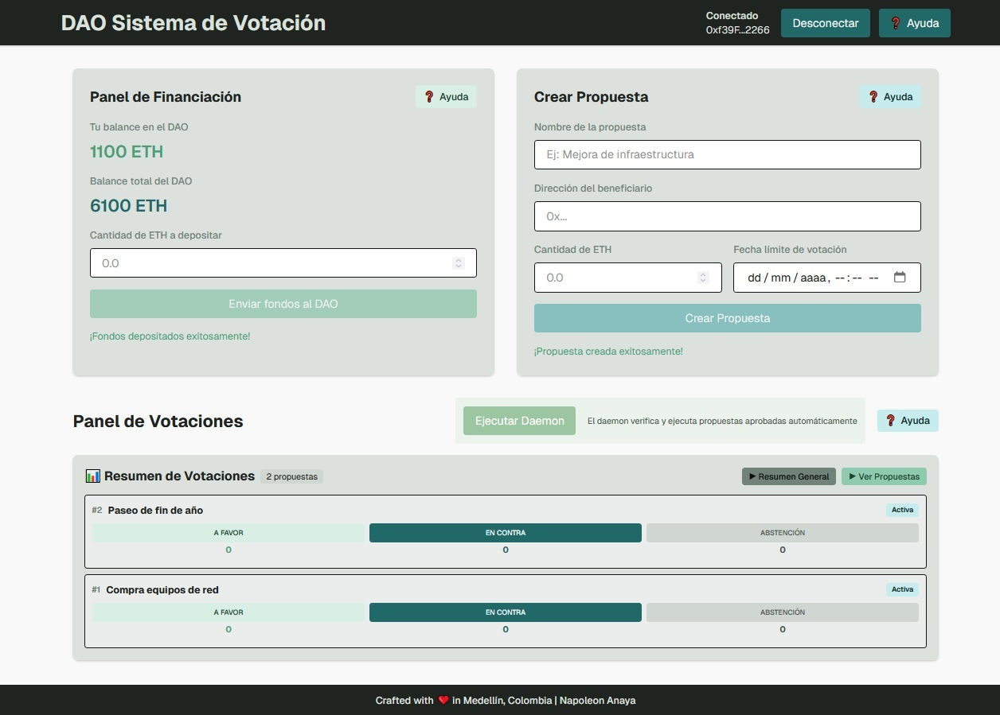

<div align="center">

# 🗳️ DAO Voting System

**A decentralized autonomous organization (DAO) voting system built with Solidity smart contracts and a Next.js web frontend**

[](https://opensource.org/licenses/MIT)
[](https://soliditylang.org/)
[](https://nextjs.org/)
[](https://react.dev/)

<div id="language-selector" style="margin: 20px 0;">
  <button onclick="setLanguage('en')" id="btn-en" style="padding: 8px 16px; margin: 0 5px; background-color: #0070f3; color: white; border: none; border-radius: 5px; cursor: pointer; font-weight: bold;">English</button>
  <button onclick="setLanguage('es')" id="btn-es" style="padding: 8px 16px; margin: 0 5px; background-color: #666; color: white; border: none; border-radius: 5px; cursor: pointer;">Español</button>
</div>
<p align="center">
  
</p>
</div>

---

<div id="content-en">

## 🚀 Features

- **Decentralized Voting**: Create and vote on proposals with balance-weighted voting power
- **Gasless Transactions**: Vote without paying gas fees using meta-transactions (EIP-712)
- **Proposal Management**: Create proposals, vote (FOR/AGAINST/ABSTAIN), and execute approved proposals
- **Automatic Contract Sync**: Contract addresses automatically synchronized from deployment logs
- **Modern Stack**: Built with Next.js 16, React 19, Wagmi v3, and Foundry
- **Responsive Design**: Professional UI that works on all devices
- **Help System**: Comprehensive help modals and documentation

## 📋 Table of Contents

- [Architecture](#architecture)
- [Prerequisites](#prerequisites)
- [Installation](#installation)
- [Configuration](#configuration)
- [Usage](#usage)
- [Project Structure](#project-structure)
- [Smart Contracts](#smart-contracts)
- [Frontend](#frontend)
- [API Routes](#api-routes)
- [Examples](#examples)
- [Troubleshooting](#troubleshooting)
- [Contributing](#contributing)
- [License](#license)

## 🏗️ Architecture

The project consists of two main components:

1. **Smart Contracts** (`sc/`): Solidity contracts deployed using Foundry

   - `DAOVoting.sol`: Main DAO contract with voting and proposal management
   - `MinimalForwarder.sol`: Meta-transaction forwarder for gasless voting

2. **Web Frontend** (`web/`): Next.js application with Web3 integration
   - React components for UI
   - Wagmi hooks for blockchain interactions
   - API routes for meta-transaction relay and contract synchronization

## 📦 Prerequisites

Before you begin, ensure you have the following installed:

- **Node.js** 20.x or higher
- **Foundry** (for smart contract development)
- **Git**

### Installing Foundry

```bash
curl -L https://foundry.paradigm.xyz | bash
foundryup
```

Verify installation:

```bash
forge --version
anvil --version
```

## 🔧 Installation

1. **Clone the repository**:

```bash
git clone <repository-url>
cd alucart2005
```

2. **Install frontend dependencies**:

```bash
cd web
npm install
```

3. **Install Foundry dependencies** (if not already installed):

```bash
cd ../sc
forge install
```

## ⚙️ Configuration

### 1. Start Anvil (Local Blockchain)

In a terminal, start the local blockchain:

```bash
cd sc
anvil
```

Anvil will start on `http://127.0.0.1:8545` with 10 pre-funded accounts.

### 2. Deploy Smart Contracts

In a new terminal:

```bash
cd sc
export PRIVATE_KEY=0xac0974bec39a17e36ba4a6b4d238ff944bacb478cbed5efcae784d7bf4f2ff80
forge script script/DeployLocal.s.sol:DeployLocal \
  --rpc-url http://localhost:8545 \
  --broadcast \
  -vvvv
```

**Expected output**:

```
Deploying MinimalForwarder...
MinimalForwarder deployed at: 0x5FbDB2315678afecb367f032d93F642f64180aa3
Deploying DAOVoting...
DAOVoting deployed at: 0xe7f1725E7734CE288F8367e1Bb143E90bb3F0512
```

### 3. Configure Environment Variables

Contract addresses are **automatically synchronized** from deployment logs to `web/.env.local` when you run `npm run dev`. However, you can also create the file manually:

```bash
cd web
cat > .env.local << 'EOF'
NEXT_PUBLIC_DAO_ADDRESS=0xe7f1725E7734CE288F8367e1Bb143E90bb3F0512
NEXT_PUBLIC_FORWARDER_ADDRESS=0x5FbDB2315678afecb367f032d93F642f64180aa3
NEXT_PUBLIC_CHAIN_ID=31337
NEXT_PUBLIC_RPC_URL=http://127.0.0.1:8545
RELAYER_PRIVATE_KEY=0x59c6995e998f97a5a0044966f0945389dc9e86dae88c7a8412f4603b6b78690d
RELAYER_ADDRESS=0x70997970C51812dc3A010C7d01b50e0d17dc79C8
EOF
```

> **Note**: The relayer private key and address are from Anvil's default accounts. In production, use secure key management.

## 🎯 Usage

### Development Mode

1. **Start Anvil** (if not already running):

```bash
cd sc
anvil
```

2. **Deploy contracts** (if not already deployed):

```bash
cd sc
export PRIVATE_KEY=0xac0974bec39a17e36ba4a6b4d238ff944bacb478cbed5efcae784d7bf4f2ff80
forge script script/DeployLocal.s.sol:DeployLocal --rpc-url http://localhost:8545 --broadcast
```

3. **Start the development server**:

```bash
cd web
npm run dev
```

The application will automatically:

- Sync contract addresses from deployment logs
- Start the Next.js development server
- Open at `http://localhost:3000`

### Production Build

```bash
cd web
npm run build
npm start
```

### Manual Contract Synchronization

If you need to manually sync contract addresses:

```bash
cd web
npm run sync-contracts          # Normal sync
npm run sync-contracts:force    # Force update
npm run sync-contracts:verbose  # Verbose output
```

## 📁 Project Structure

```
alucart2005/
├── sc/                          # Smart contracts (Foundry)
│   ├── src/
│   │   ├── DAOVoting.sol       # Main DAO contract
│   │   └── MinimalForwarder.sol # Meta-transaction forwarder
│   ├── script/
│   │   ├── DeployLocal.s.sol   # Local deployment script
│   │   └── DeployTestnet.s.sol # Testnet deployment script
│   ├── test/                   # Solidity tests
│   ├── broadcast/              # Deployment transaction logs
│   └── foundry.toml            # Foundry configuration
│
├── web/                         # Next.js frontend
│   ├── app/
│   │   ├── api/                # API routes
│   │   │   ├── relay/          # Meta-transaction relay
│   │   │   ├── nonce/          # Nonce management
│   │   │   ├── daemon/         # Proposal execution daemon
│   │   │   └── sync-contracts/ # Contract sync API
│   │   ├── page.tsx            # Home page
│   │   └── layout.tsx          # Root layout
│   ├── components/             # React components
│   │   ├── FundingPanel.tsx   # DAO funding interface
│   │   ├── CreateProposal.tsx  # Proposal creation
│   │   ├── ProposalList.tsx    # Proposal listing
│   │   ├── VoteButtons.tsx     # Voting interface
│   │   └── AppHelpModal.tsx    # Application help
│   ├── hooks/                  # Custom React hooks
│   │   ├── useDAO.ts           # DAO interaction hooks
│   │   └── useGaslessVote.ts   # Gasless voting hook
│   ├── lib/
│   │   ├── config/
│   │   │   ├── chain.ts        # Wagmi chain configuration
│   │   │   └── contracts.ts    # Contract ABIs and addresses
│   │   └── utils/
│   │       └── eip712.ts       # EIP-712 utilities
│   ├── scripts/
│   │   └── sync-contracts.js   # Auto-sync contract addresses
│   └── package.json
│
└── README.md
```

## 🔐 Smart Contracts

### DAOVoting Contract

The main DAO contract that handles:

- Proposal creation and management
- Balance-weighted voting
- Proposal execution
- Fund management

**Key Functions**:

```solidity
// Fund the DAO
function fundDAO() external payable;

// Create a proposal (requires 10% of total balance)
function createProposal(address recipient, uint256 amount, uint256 deadline) external;

// Vote on a proposal
function vote(uint256 proposalId, VoteType voteType) external;

// Execute an approved proposal
function executeProposal(uint256 proposalId) external;

// View functions
function getUserBalance(address user) external view returns (uint256);
function totalBalance() external view returns (uint256);
function getProposal(uint256 proposalId) external view returns (Proposal memory);
```

**Proposal Requirements**:

- Minimum 10% of total DAO balance to create proposals
- 1-day execution delay after voting deadline
- Proposals pass if `votesFor > votesAgainst`

### MinimalForwarder Contract

Handles meta-transactions (ERC-2771) for gasless voting:

- Verifies EIP-712 signatures
- Forwards calls to DAOVoting contract
- Manages nonces to prevent replay attacks

## 💻 Frontend

### Components

#### FundingPanel

Allows users to deposit ETH into the DAO:

```tsx
import { FundingPanel } from "@/components/FundingPanel";

<FundingPanel />;
```

Features:

- Display user balance in DAO
- Display total DAO balance
- Deposit ETH to increase voting power

#### CreateProposal

Create new proposals:

```tsx
import { CreateProposal } from "@/components/CreateProposal";

<CreateProposal onProposalCreated={handleProposalCreated} />;
```

#### ProposalList

Display all proposals:

```tsx
import { ProposalList } from "@/components/ProposalList";

<ProposalList refreshTrigger={refreshTrigger} />;
```

### Hooks

#### useDAO

Main hook for DAO interactions:

```typescript
import { useUserBalance, useTotalBalance, useFundDAO } from "@/hooks/useDAO";

// Get user balance
const { balance, balanceWei, isLoading, error } = useUserBalance();

// Get total DAO balance
const { totalBalance, isLoading, error } = useTotalBalance();

// Fund the DAO
const { fundDAO, isPending, isSuccess, error } = useFundDAO();
fundDAO("1.0"); // Deposit 1 ETH
```

#### useGaslessVote

Vote without paying gas:

```typescript
import { useGaslessVote } from "@/hooks/useGaslessVote";

const { voteGasless, isPending, error } = useGaslessVote();
voteGasless(proposalId, VoteType.FOR);
```

## 🔌 API Routes

### POST /api/relay

Relay meta-transactions for gasless voting:

```typescript
const response = await fetch("/api/relay", {
  method: "POST",
  headers: { "Content-Type": "application/json" },
  body: JSON.stringify({
    request: forwardRequest,
    signature: signature,
  }),
});
```

### GET /api/nonce

Get current nonce for an address:

```typescript
const response = await fetch(
  `/api/nonce?address=${address}&forwarder=${forwarderAddress}`
);
const { nonce } = await response.json();
```

### GET /api/sync-contracts

Manually trigger contract address synchronization:

```typescript
const response = await fetch("/api/sync-contracts?force=true");
const { success, output } = await response.json();
```

### POST /api/daemon

Trigger automatic proposal execution:

```typescript
const response = await fetch("/api/daemon", { method: "POST" });
const { executed } = await response.json();
```

## 📝 Examples

### Example 1: Fund the DAO

```typescript
import { useFundDAO } from "@/hooks/useDAO";

function FundButton() {
  const { fundDAO, isPending, isSuccess, error } = useFundDAO();

  const handleFund = () => {
    fundDAO("1.0"); // Deposit 1 ETH
  };

  return (
    <button onClick={handleFund} disabled={isPending}>
      {isPending ? "Depositing..." : "Fund DAO"}
    </button>
  );
}
```

### Example 2: Create a Proposal

```typescript
import { useCreateProposal } from "@/hooks/useDAO";

function CreateProposalForm() {
  const { createProposal, isPending } = useCreateProposal();
  const [recipient, setRecipient] = useState("");
  const [amount, setAmount] = useState("");
  const [deadline, setDeadline] = useState("");

  const handleSubmit = () => {
    const deadlineTimestamp = BigInt(
      Math.floor(new Date(deadline).getTime() / 1000)
    );
    createProposal(recipient, amount, deadlineTimestamp);
  };

  return <form onSubmit={handleSubmit}>{/* Form fields */}</form>;
}
```

### Example 3: Vote on a Proposal

```typescript
import { useGaslessVote } from "@/hooks/useGaslessVote";
import { VoteType } from "@/lib/config/contracts";

function VoteButtons({ proposalId }: { proposalId: bigint }) {
  const { voteGasless, isPending } = useGaslessVote();

  return (
    <div>
      <button onClick={() => voteGasless(proposalId, VoteType.FOR)}>
        Vote FOR
      </button>
      <button onClick={() => voteGasless(proposalId, VoteType.AGAINST)}>
        Vote AGAINST
      </button>
      <button onClick={() => voteGasless(proposalId, VoteType.ABSTAIN)}>
        ABSTAIN
      </button>
    </div>
  );
}
```

## 🐛 Troubleshooting

### Contract Not Deployed Error

**Error**: `The contract function "getUserBalance" returned no data ("0x")`

**Solution**:

1. Ensure Anvil is running: `cd sc && anvil`
2. Deploy contracts: `forge script script/DeployLocal.s.sol:DeployLocal --rpc-url http://localhost:8545 --broadcast`
3. Contract addresses will auto-sync, or run: `npm run sync-contracts`

### Address Mismatch

**Problem**: Contract addresses in `.env.local` don't match deployed contracts

**Solution**:

```bash
cd web
npm run sync-contracts:force
```

### Anvil Restarted

**Problem**: Anvil was restarted and contracts are lost

**Solution**: Redeploy contracts (addresses will be different):

```bash
cd sc
forge script script/DeployLocal.s.sol:DeployLocal --rpc-url http://localhost:8545 --broadcast
```

### Wallet Connection Issues

**Problem**: Wallet won't connect or shows wrong network

**Solution**:

1. Ensure you're connected to the correct network (Chain ID: 31337)
2. Add the local network to your wallet:
   - Network Name: Local Anvil
   - RPC URL: http://127.0.0.1:8545
   - Chain ID: 31337
   - Currency Symbol: ETH

### Meta-Transaction Failures

**Problem**: Gasless voting fails

**Solution**:

1. Check relayer has ETH: `cast balance $RELAYER_ADDRESS --rpc-url http://localhost:8545`
2. Verify relayer configuration in `.env.local`
3. Check API route logs for errors

## 🧪 Testing

### Smart Contract Tests

```bash
cd sc
forge test
```

### Frontend Tests

```bash
cd web
npm test
```

## 📚 Additional Resources

- [Foundry Book](https://book.getfoundry.sh/) - Foundry documentation
- [Wagmi Documentation](https://wagmi.sh/) - Wagmi v3 docs
- [Next.js Documentation](https://nextjs.org/docs) - Next.js 16 docs
- [OpenZeppelin Contracts](https://docs.openzeppelin.com/contracts) - Security patterns

## 🤝 Contributing

Contributions are welcome! Please follow these steps:

1. Fork the repository
2. Create a feature branch (`git checkout -b feature/amazing-feature`)
3. Commit your changes (`git commit -m 'Add some amazing feature'`)
4. Push to the branch (`git push origin feature/amazing-feature`)
5. Open a Pull Request

## 📄 License

This project is licensed under the MIT License - see the LICENSE file for details.

## 🙏 Acknowledgments

- [OpenZeppelin](https://openzeppelin.com/) for secure contract patterns
- [Foundry](https://getfoundry.sh/) for the development framework
- [Wagmi](https://wagmi.sh/) for Web3 React hooks
- [Next.js](https://nextjs.org/) for the React framework

---

**Built with ❤️ for decentralized governance**

</div>

<div id="content-es" style="display: none;">

## 🚀 Características

- **Votación Descentralizada**: Crear y votar propuestas con poder de voto ponderado por balance
- **Transacciones Sin Gas**: Votar sin pagar comisiones usando meta-transacciones (EIP-712)
- **Gestión de Propuestas**: Crear propuestas, votar (A FAVOR/EN CONTRA/ABSTENCIÓN) y ejecutar propuestas aprobadas
- **Sincronización Automática**: Direcciones de contratos sincronizadas automáticamente desde logs de despliegue
- **Stack Moderno**: Construido con Next.js 16, React 19, Wagmi v3 y Foundry
- **Diseño Responsive**: Interfaz profesional que funciona en todos los dispositivos
- **Sistema de Ayuda**: Modales de ayuda y documentación completos

## 📋 Tabla de Contenidos

- [Arquitectura](#arquitectura)
- [Requisitos Previos](#requisitos-previos)
- [Instalación](#instalación)
- [Configuración](#configuración)
- [Uso](#uso)
- [Estructura del Proyecto](#estructura-del-proyecto)
- [Contratos Inteligentes](#contratos-inteligentes)
- [Frontend](#frontend)
- [Rutas API](#rutas-api)
- [Ejemplos](#ejemplos)
- [Solución de Problemas](#solución-de-problemas)
- [Contribuir](#contribuir)
- [Licencia](#licencia)

## 🏗️ Arquitectura

El proyecto consta de dos componentes principales:

1. **Contratos Inteligentes** (`sc/`): Contratos Solidity desplegados usando Foundry

   - `DAOVoting.sol`: Contrato principal del DAO con votación y gestión de propuestas
   - `MinimalForwarder.sol`: Forwarder de meta-transacciones para votación sin gas

2. **Frontend Web** (`web/`): Aplicación Next.js con integración Web3
   - Componentes React para la UI
   - Hooks Wagmi para interacciones con blockchain
   - Rutas API para relay de meta-transacciones y sincronización de contratos

## 📦 Requisitos Previos

Antes de comenzar, asegúrate de tener instalado lo siguiente:

- **Node.js** 20.x o superior
- **Foundry** (para desarrollo de contratos inteligentes)
- **Git**

### Instalando Foundry

```bash
curl -L https://foundry.paradigm.xyz | bash
foundryup
```

Verificar instalación:

```bash
forge --version
anvil --version
```

## 🔧 Instalación

1. **Clonar el repositorio**:

```bash
git clone <repository-url>
cd alucart2005
```

2. **Instalar dependencias del frontend**:

```bash
cd web
npm install
```

3. **Instalar dependencias de Foundry** (si no están instaladas):

```bash
cd ../sc
forge install
```

## ⚙️ Configuración

### 1. Iniciar Anvil (Blockchain Local)

En una terminal, inicia la blockchain local:

```bash
cd sc
anvil
```

Anvil se iniciará en `http://127.0.0.1:8545` con 10 cuentas pre-fondeadas.

### 2. Desplegar Contratos Inteligentes

En una nueva terminal:

```bash
cd sc
export PRIVATE_KEY=0xac0974bec39a17e36ba4a6b4d238ff944bacb478cbed5efcae784d7bf4f2ff80
forge script script/DeployLocal.s.sol:DeployLocal \
  --rpc-url http://localhost:8545 \
  --broadcast \
  -vvvv
```

**Salida esperada**:

```
Deploying MinimalForwarder...
MinimalForwarder deployed at: 0x5FbDB2315678afecb367f032d93F642f64180aa3
Deploying DAOVoting...
DAOVoting deployed at: 0xe7f1725E7734CE288F8367e1Bb143E90bb3F0512
```

### 3. Configurar Variables de Entorno

Las direcciones de los contratos se **sincronizan automáticamente** desde los logs de despliegue a `web/.env.local` cuando ejecutas `npm run dev`. Sin embargo, también puedes crear el archivo manualmente:

```bash
cd web
cat > .env.local << 'EOF'
NEXT_PUBLIC_DAO_ADDRESS=0xe7f1725E7734CE288F8367e1Bb143E90bb3F0512
NEXT_PUBLIC_FORWARDER_ADDRESS=0x5FbDB2315678afecb367f032d93F642f64180aa3
NEXT_PUBLIC_CHAIN_ID=31337
NEXT_PUBLIC_RPC_URL=http://127.0.0.1:8545
RELAYER_PRIVATE_KEY=0x59c6995e998f97a5a0044966f0945389dc9e86dae88c7a8412f4603b6b78690d
RELAYER_ADDRESS=0x70997970C51812dc3A010C7d01b50e0d17dc79C8
EOF
```

> **Nota**: La clave privada y dirección del relayer son de las cuentas predeterminadas de Anvil. En producción, usa gestión segura de claves.

## 🎯 Uso

### Modo Desarrollo

1. **Iniciar Anvil** (si no está corriendo):

```bash
cd sc
anvil
```

2. **Desplegar contratos** (si no están desplegados):

```bash
cd sc
export PRIVATE_KEY=0xac0974bec39a17e36ba4a6b4d238ff944bacb478cbed5efcae784d7bf4f2ff80
forge script script/DeployLocal.s.sol:DeployLocal --rpc-url http://localhost:8545 --broadcast
```

3. **Iniciar el servidor de desarrollo**:

```bash
cd web
npm run dev
```

La aplicación automáticamente:

- Sincronizará las direcciones de contratos desde los logs de despliegue
- Iniciará el servidor de desarrollo de Next.js
- Se abrirá en `http://localhost:3000`

### Build de Producción

```bash
cd web
npm run build
npm start
```

### Sincronización Manual de Contratos

Si necesitas sincronizar manualmente las direcciones de contratos:

```bash
cd web
npm run sync-contracts          # Sincronización normal
npm run sync-contracts:force    # Actualización forzada
npm run sync-contracts:verbose  # Salida detallada
```

## 📁 Estructura del Proyecto

```
alucart2005/
├── sc/                          # Contratos inteligentes (Foundry)
│   ├── src/
│   │   ├── DAOVoting.sol       # Contrato principal del DAO
│   │   └── MinimalForwarder.sol # Forwarder de meta-transacciones
│   ├── script/
│   │   ├── DeployLocal.s.sol   # Script de despliegue local
│   │   └── DeployTestnet.s.sol # Script de despliegue en testnet
│   ├── test/                   # Tests de Solidity
│   ├── broadcast/              # Logs de transacciones de despliegue
│   └── foundry.toml            # Configuración de Foundry
│
├── web/                         # Frontend Next.js
│   ├── app/
│   │   ├── api/                # Rutas API
│   │   │   ├── relay/          # Relay de meta-transacciones
│   │   │   ├── nonce/          # Gestión de nonces
│   │   │   ├── daemon/         # Daemon de ejecución de propuestas
│   │   │   └── sync-contracts/ # API de sincronización de contratos
│   │   ├── page.tsx            # Página principal
│   │   └── layout.tsx          # Layout raíz
│   ├── components/             # Componentes React
│   │   ├── FundingPanel.tsx   # Interfaz de financiación del DAO
│   │   ├── CreateProposal.tsx  # Creación de propuestas
│   │   ├── ProposalList.tsx    # Listado de propuestas
│   │   ├── VoteButtons.tsx     # Interfaz de votación
│   │   └── AppHelpModal.tsx    # Ayuda de la aplicación
│   ├── hooks/                  # Hooks personalizados de React
│   │   ├── useDAO.ts           # Hooks de interacción con DAO
│   │   └── useGaslessVote.ts   # Hook de votación sin gas
│   ├── lib/
│   │   ├── config/
│   │   │   ├── chain.ts        # Configuración de chain de Wagmi
│   │   │   └── contracts.ts    # ABIs y direcciones de contratos
│   │   └── utils/
│   │       └── eip712.ts       # Utilidades EIP-712
│   ├── scripts/
│   │   └── sync-contracts.js   # Auto-sincronización de direcciones
│   └── package.json
│
└── README.md
```

## 🔐 Contratos Inteligentes

### Contrato DAOVoting

El contrato principal del DAO que maneja:

- Creación y gestión de propuestas
- Votación ponderada por balance
- Ejecución de propuestas
- Gestión de fondos

**Funciones Principales**:

```solidity
// Financiar el DAO
function fundDAO() external payable;

// Crear una propuesta (requiere 10% del balance total)
function createProposal(address recipient, uint256 amount, uint256 deadline) external;

// Votar en una propuesta
function vote(uint256 proposalId, VoteType voteType) external;

// Ejecutar una propuesta aprobada
function executeProposal(uint256 proposalId) external;

// Funciones de lectura
function getUserBalance(address user) external view returns (uint256);
function totalBalance() external view returns (uint256);
function getProposal(uint256 proposalId) external view returns (Proposal memory);
```

**Requisitos de Propuestas**:

- Mínimo 10% del balance total del DAO para crear propuestas
- Retraso de ejecución de 1 día después de la fecha límite de votación
- Las propuestas se aprueban si `votesFor > votesAgainst`

### Contrato MinimalForwarder

Maneja meta-transacciones (ERC-2771) para votación sin gas:

- Verifica firmas EIP-712
- Reenvía llamadas al contrato DAOVoting
- Gestiona nonces para prevenir ataques de replay

## 💻 Frontend

### Componentes

#### FundingPanel

Permite a los usuarios depositar ETH en el DAO:

```tsx
import { FundingPanel } from "@/components/FundingPanel";

<FundingPanel />;
```

Características:

- Mostrar balance del usuario en el DAO
- Mostrar balance total del DAO
- Depositar ETH para aumentar el poder de voto

#### CreateProposal

Crear nuevas propuestas:

```tsx
import { CreateProposal } from "@/components/CreateProposal";

<CreateProposal onProposalCreated={handleProposalCreated} />;
```

#### ProposalList

Mostrar todas las propuestas:

```tsx
import { ProposalList } from "@/components/ProposalList";

<ProposalList refreshTrigger={refreshTrigger} />;
```

### Hooks

#### useDAO

Hook principal para interacciones con el DAO:

```typescript
import { useUserBalance, useTotalBalance, useFundDAO } from "@/hooks/useDAO";

// Obtener balance del usuario
const { balance, balanceWei, isLoading, error } = useUserBalance();

// Obtener balance total del DAO
const { totalBalance, isLoading, error } = useTotalBalance();

// Financiar el DAO
const { fundDAO, isPending, isSuccess, error } = useFundDAO();
fundDAO("1.0"); // Depositar 1 ETH
```

#### useGaslessVote

Votar sin pagar gas:

```typescript
import { useGaslessVote } from "@/hooks/useGaslessVote";

const { voteGasless, isPending, error } = useGaslessVote();
voteGasless(proposalId, VoteType.FOR);
```

## 🔌 Rutas API

### POST /api/relay

Relay de meta-transacciones para votación sin gas:

```typescript
const response = await fetch("/api/relay", {
  method: "POST",
  headers: { "Content-Type": "application/json" },
  body: JSON.stringify({
    request: forwardRequest,
    signature: signature,
  }),
});
```

### GET /api/nonce

Obtener nonce actual para una dirección:

```typescript
const response = await fetch(
  `/api/nonce?address=${address}&forwarder=${forwarderAddress}`
);
const { nonce } = await response.json();
```

### GET /api/sync-contracts

Activar manualmente la sincronización de direcciones de contratos:

```typescript
const response = await fetch("/api/sync-contracts?force=true");
const { success, output } = await response.json();
```

### POST /api/daemon

Activar ejecución automática de propuestas:

```typescript
const response = await fetch("/api/daemon", { method: "POST" });
const { executed } = await response.json();
```

## 📝 Ejemplos

### Ejemplo 1: Financiar el DAO

```typescript
import { useFundDAO } from "@/hooks/useDAO";

function FundButton() {
  const { fundDAO, isPending, isSuccess, error } = useFundDAO();

  const handleFund = () => {
    fundDAO("1.0"); // Depositar 1 ETH
  };

  return (
    <button onClick={handleFund} disabled={isPending}>
      {isPending ? "Depositando..." : "Financiar DAO"}
    </button>
  );
}
```

### Ejemplo 2: Crear una Propuesta

```typescript
import { useCreateProposal } from "@/hooks/useDAO";

function CreateProposalForm() {
  const { createProposal, isPending } = useCreateProposal();
  const [recipient, setRecipient] = useState("");
  const [amount, setAmount] = useState("");
  const [deadline, setDeadline] = useState("");

  const handleSubmit = () => {
    const deadlineTimestamp = BigInt(
      Math.floor(new Date(deadline).getTime() / 1000)
    );
    createProposal(recipient, amount, deadlineTimestamp);
  };

  return <form onSubmit={handleSubmit}>{/* Campos del formulario */}</form>;
}
```

### Ejemplo 3: Votar en una Propuesta

```typescript
import { useGaslessVote } from "@/hooks/useGaslessVote";
import { VoteType } from "@/lib/config/contracts";

function VoteButtons({ proposalId }: { proposalId: bigint }) {
  const { voteGasless, isPending } = useGaslessVote();

  return (
    <div>
      <button onClick={() => voteGasless(proposalId, VoteType.FOR)}>
        Votar A FAVOR
      </button>
      <button onClick={() => voteGasless(proposalId, VoteType.AGAINST)}>
        Votar EN CONTRA
      </button>
      <button onClick={() => voteGasless(proposalId, VoteType.ABSTAIN)}>
        ABSTENERSE
      </button>
    </div>
  );
}
```

## 🐛 Solución de Problemas

### Error de Contrato No Desplegado

**Error**: `The contract function "getUserBalance" returned no data ("0x")`

**Solución**:

1. Asegúrate de que Anvil esté corriendo: `cd sc && anvil`
2. Despliega los contratos: `forge script script/DeployLocal.s.sol:DeployLocal --rpc-url http://localhost:8545 --broadcast`
3. Las direcciones de contratos se sincronizarán automáticamente, o ejecuta: `npm run sync-contracts`

### Direcciones No Coinciden

**Problema**: Las direcciones de contratos en `.env.local` no coinciden con los contratos desplegados

**Solución**:

```bash
cd web
npm run sync-contracts:force
```

### Anvil Reiniciado

**Problema**: Anvil fue reiniciado y los contratos se perdieron

**Solución**: Redesplegar contratos (las direcciones serán diferentes):

```bash
cd sc
forge script script/DeployLocal.s.sol:DeployLocal --rpc-url http://localhost:8545 --broadcast
```

### Problemas de Conexión de Wallet

**Problema**: La wallet no se conecta o muestra la red incorrecta

**Solución**:

1. Asegúrate de estar conectado a la red correcta (Chain ID: 31337)
2. Agrega la red local a tu wallet:
   - Nombre de Red: Local Anvil
   - RPC URL: http://127.0.0.1:8545
   - Chain ID: 31337
   - Símbolo de Moneda: ETH

### Fallos de Meta-Transacciones

**Problema**: La votación sin gas falla

**Solución**:

1. Verifica que el relayer tenga ETH: `cast balance $RELAYER_ADDRESS --rpc-url http://localhost:8545`
2. Verifica la configuración del relayer en `.env.local`
3. Revisa los logs de las rutas API para errores

## 🧪 Testing

### Tests de Contratos Inteligentes

```bash
cd sc
forge test
```

### Tests del Frontend

```bash
cd web
npm test
```

## 📚 Recursos Adicionales

- [Foundry Book](https://book.getfoundry.sh/) - Documentación de Foundry
- [Wagmi Documentation](https://wagmi.sh/) - Documentación de Wagmi v3
- [Next.js Documentation](https://nextjs.org/docs) - Documentación de Next.js 16
- [OpenZeppelin Contracts](https://docs.openzeppelin.com/contracts) - Patrones de seguridad

## 🤝 Contribuir

¡Las contribuciones son bienvenidas! Por favor sigue estos pasos:

1. Haz fork del repositorio
2. Crea una rama de funcionalidad (`git checkout -b feature/amazing-feature`)
3. Commitea tus cambios (`git commit -m 'Add some amazing feature'`)
4. Push a la rama (`git push origin feature/amazing-feature`)
5. Abre un Pull Request

## 📄 Licencia

Este proyecto está licenciado bajo la Licencia MIT - ver el archivo LICENSE para más detalles.

## 🙏 Agradecimientos

- [OpenZeppelin](https://openzeppelin.com/) por los patrones de contratos seguros
- [Foundry](https://getfoundry.sh/) por el framework de desarrollo
- [Wagmi](https://wagmi.sh/) por los hooks React de Web3
- [Next.js](https://nextjs.org/) por el framework React

---

**Construido con ❤️ para gobernanza descentralizada**

</div>

<script>
(function() {
  // Get language from localStorage or default to 'en'
  let currentLang = localStorage.getItem('readme-lang') || 'en';
  
  function setLanguage(lang) {
    currentLang = lang;
    localStorage.setItem('readme-lang', lang);
    
    // Show/hide content
    document.getElementById('content-en').style.display = lang === 'en' ? 'block' : 'none';
    document.getElementById('content-es').style.display = lang === 'es' ? 'block' : 'none';
    
    // Update button styles
    const btnEn = document.getElementById('btn-en');
    const btnEs = document.getElementById('btn-es');
    
    if (lang === 'en') {
      btnEn.style.backgroundColor = '#0070f3';
      btnEn.style.fontWeight = 'bold';
      btnEs.style.backgroundColor = '#666';
      btnEs.style.fontWeight = 'normal';
    } else {
      btnEs.style.backgroundColor = '#0070f3';
      btnEs.style.fontWeight = 'bold';
      btnEn.style.backgroundColor = '#666';
      btnEn.style.fontWeight = 'normal';
    }
  }
  
  // Make setLanguage available globally
  window.setLanguage = setLanguage;
  
  // Set initial language
  setLanguage(currentLang);
})();
</script>
